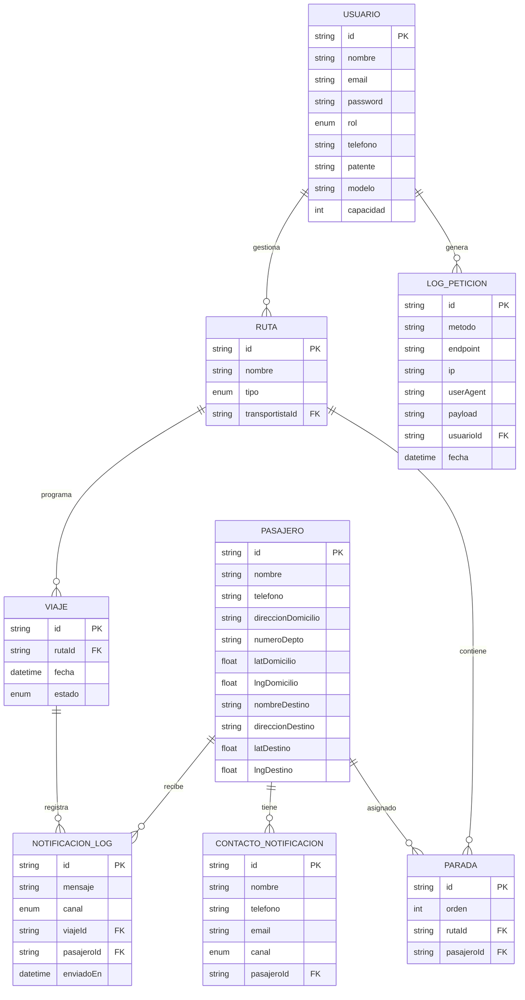

# Diagrama de Entidad-Relación (ER)

Este diagrama representa la estructura de la base de datos para la aplicación **RutaSegura**, incluyendo el flujo de usuarios y logs de peticiones.

## Descripción de Entidades

- **Usuario**: Representa tanto a administradores como a transportistas. Incluye credenciales para el flujo de registro y login. Si el rol es `TRANSPORTISTA`, se completan los campos de vehículo (`patente`, `modelo`, `capacidad`).
- **LogPeticion**: Registra cada petición realizada por los usuarios a la API para auditoría y seguridad.
- **Pasajero**: Persona transportada con información de origen y destino.
- **ContactoNotificacion**: Tutores o familiares asociados a un pasajero.
- **Ruta**: Trayecto programado asignado a un transportista.
- **Parada**: Orden de visita de pasajeros dentro de una ruta.
- **Viaje**: Ejecución diaria o puntual de una ruta.
- **NotificacionLog**: Historial de alertas enviadas durante los viajes.
